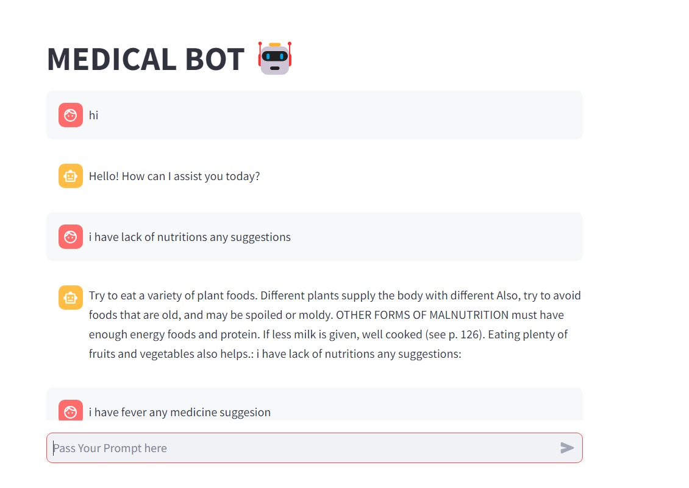
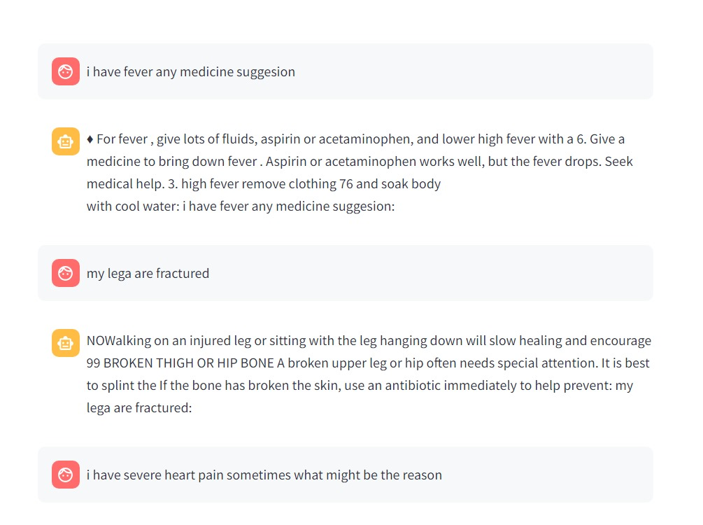
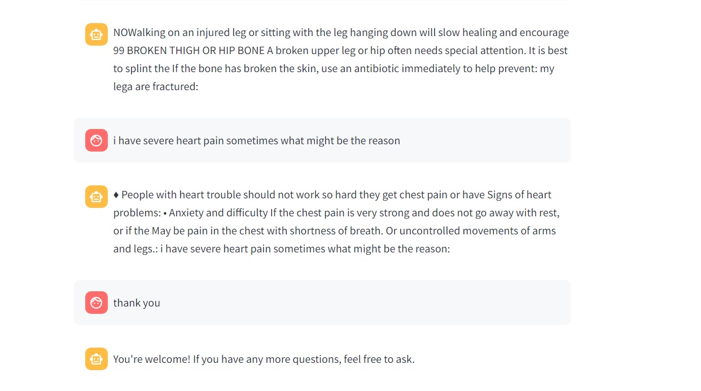
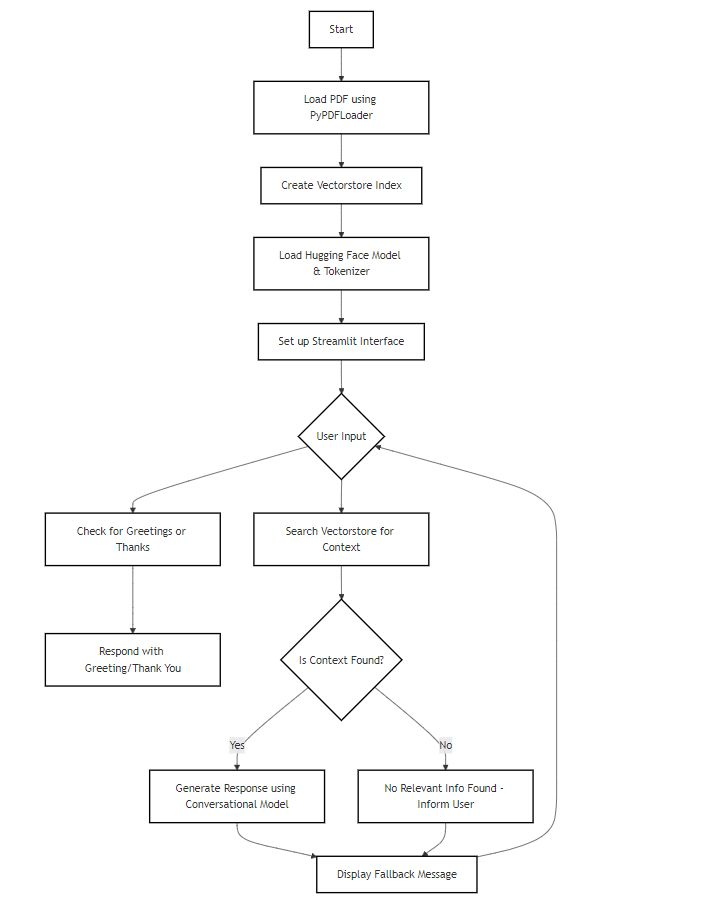

# Medbot : A Streamlit-Powered Medical Conversational AI 🎯

## Basic Details
### Team Name: Abcd

### Team Members
- Team Lead: Akshay K Prasad   - Sahrdaya College of Engineering and Technology 
- Member 1:  Akshay K Prasad   - Sahrdaya College of Engineering and Technology
- Member 2:  Ashifa M S        - Sahrdaya College of Engineering and Technology

### Project Description
MedBot is an innovative AI-powered medical conversational assistant designed to provide accurate and informative responses to medical-related queries. This project aims to bridge the gap between medical knowledge and accessibility, providing users
with a user-friendly interface to interact with a medical expert-like assistant.

### The Problem (that doesn't exist)
Medical chatbots are so bored with sensible questions, they're starting to think humans have lost their ability to ask ridiculous, Google-worthy questions.Also because self-diagnosis is the new national pastime.

### The Solution (that nobody asked for)
Introducing "MedBot: The Absurdity Generator"!
 MedBot will:  
1. Randomly generate nonsensical medical questions.
2. Provide hilariously incorrect answers.
 How We'll Solve It :  
1. Develop AI-powered "Nonsensical Question Generator" (NQG).
2. Train MedBot with "Trolling Algorithms".
   
## Technical Details
### Technologies/Components Used
For Software:
- Languages used   :-  Python
- Frameworks used  :-  Streamlit , Hugging Face Transformers
- Libraries used   :-  Langchain , PyPDF2 , Sentence-Transformers , NLTK , spaCy
- Tools used       :-  Hugging Face Model Hub , GitHub , Streamlit Sharing , Jupyter Notebook

### Implementation
For Software:
# Installation
 brew install python (Mac) or sudo apt-get install python3.9(Ubuntu) 
 python -m ensurepip 
 pip install streamlit 
 pip install transformers 
 pip install langchain 
 pip install PyPDF2 
 pip install sentence-transformers 
 pip install nltk 
 pip install spacy 
 pip install huggingface-hub 
 pip install sentence-transformers==2.2.0 
 pip install transformers==4.21.3 
 pip install transformers 
 pip install huggingface-hub 
 pip install streamlit 
 pip install langchain 
 pip install langchain[pdf] 
 brew install git (Mac) or sudo apt-get install git (Ubuntu) 
 pip install jupyter 
 export HUGGINGFACEHUB_API_TOKEN=YOUR_API_TOKEN  
 export HUGGINGFACE_MODEL_REPO=YOUR_MODEL_REPO 

# Run
streamlit run app.py

### Project Documentation
For Software:   MedBot is a conversational AI-powered chatbot that provides accurate and reliable medical information to users through a user-friendly interface, leveraging natural language processing, medical databases, and Hugging Face Transformers, with the goal of enhancing healthcare accessibility and user experience.

# Screenshots (Add at least 3)

Shows the begining of interface of our chatbot.The basic hi hello response is shown.

Asking the bot queries about symptoms and basic medicine suggestions.

 The similar queries to earlier. 

# Diagrams

 Demonstrates the backend and flow of program. 

# Video[
(https://drive.google.com/file/d/1XwN-FafpUY9Q33RgKiNf7_KqSeVl-ArN/view?usp=drivesdk)

# Team Contributions
Akshay   -   Build the backend,trained AI Models and curated Medical Databases.
 Ashifa   - Build Medbot Interface,Managed project timeline and Github repository. 
Shared Responsibilities   : Collaboration,Testing and Documentation
